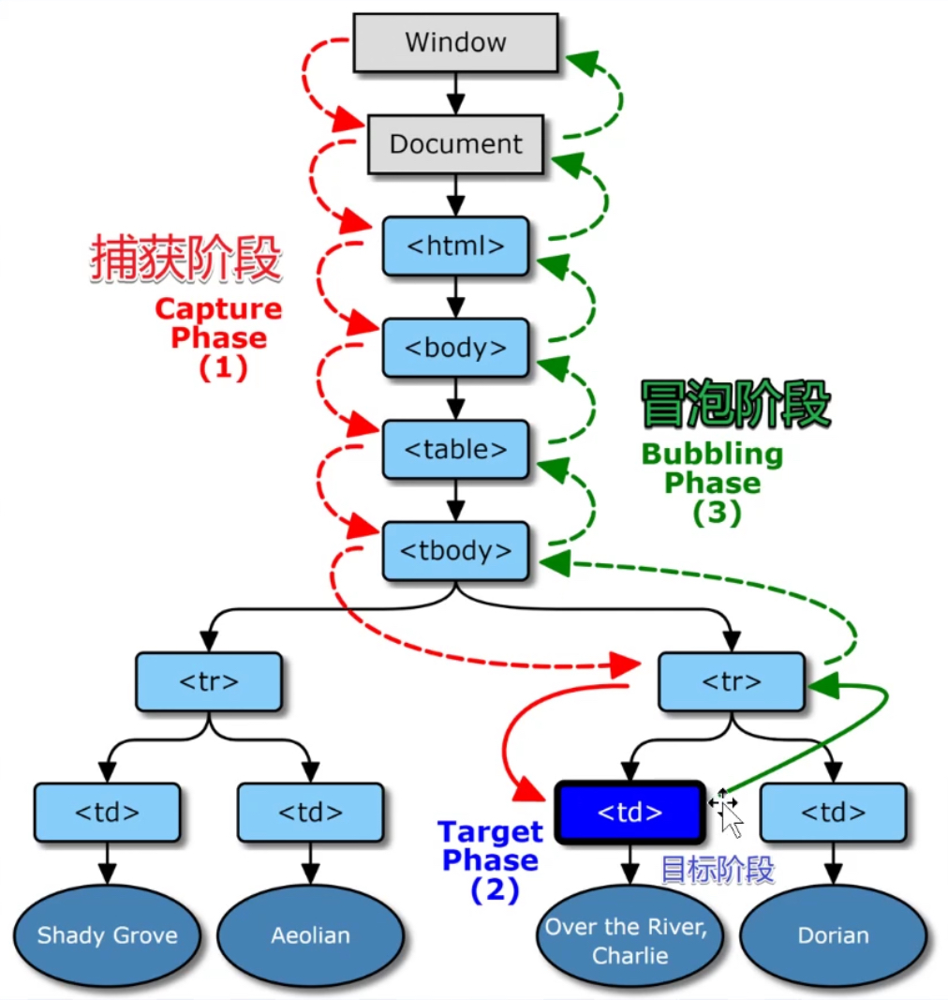

# jQuery设计思想

#### 1.   特殊函数jQuery

+ `jQuery`（选择器）用于获取对应的元素
+ 但它却不返回这些元素，而是返回一个对象，称为`jQuery `构造出来的对象
+ 这个对象可以操作对应的元素

#### 2. jQuery的基本操作

```js
jQuery.fn = jQuery.prototype = {
    constructor: jQuery,
    jquery: true,
    get(index) {
        return this.elements[index];
    },
    appendTo(node) {
        if (node instanceof Element) {
            this.each(el => node.appendChild(el));
        } else if (node.jquery === true) {
            this.each(el => node.get(0).appendChild(el));
        }
    },
    append(children) {
        if (children instanceof Element) {
            this.get(0).appendChild(children);
        } else if (children instanceof HTMLCollection) {
            for (let i = 0; i < children.length; i++) {
                this.get(0).appendChild(children[i]);
            }
        } else if (children.jquery === true) {
            children.each(node => this.get(0).appendChild(node));
        }
    },
    addClass(className) {
        for (let i = 0; i < elements.length; i++) {
            elements[i].classList.add(className);
        }
        // this就是api
        return this;
    },
    find(selector) {
        let array = [];
        for (let i = 0; i < elements.length; i++) {
            const elements2 = Array.from(elements[i].querySelectorAll(selector))
            array = array.concat(elements2);
        }
        // return array;
        array.oldApi = this;
        return jQuery(array);
    },
    end() {
        return this.oldApi;
    },
    each(fn) {
        for (let i = 0; i < elements.length; i++) {
            fn.call(null, elements[i], i);
        }
        return this;
    },
    parent() {
        const array = [];
        this.each((node) => {
            if (array.indexOf(node.parentNode) === -1) {
                array.push(node.parentNode);
            }
        })
        return jQuery(array);
    },
    children() {
        const array = [];
        this.each((node) => {
            array.push(...node.children)
        })
        return jQuery(array);
    }       
}
```

#### 3.   DOM事件委托    

+ **从外向内**找监听函数，叫**事件捕获**

+ **从内向外**找监听函数，叫**事件冒泡**

  

+ `W3C`事件模型

  ```js
  div.addEventListener('click',fn,bool)
  // 若bool为不传或falsy，就让fn走冒泡
  // 若bool为true，就让fn走捕获
  ```

  + 先捕获，再冒泡

  + 注意`e`对象被传给所有监听函数

  + 事件结束后，`e`对象就不存在了

    ```js
    e.target			//用户操作的元素
    e.currentTarget		//程序员监听的元素
    
    // div > span{文字}，用户点击文字
    // e.target就是span
    // e.currentTarget就是div
    
    // 若只有一个div,监听的元素就是点击的元素
    div.addEventListener('click',f1})		//冒泡
    div.addEventListener('click',f2,true)	//捕获
    // 谁先监听，谁先执行
    
    // 中断冒泡
    e.stopPropagaion()
    
    // 有些事件不可以中断冒泡
    // 如scroll事件
    ```

  + 如何阻止滚动

    ```html
     <div id="x"></div>
     <style>
         ::-webkit-scrollbar{
             width: 0 !import
         }
     </style>
     <script>
            x.addEventListener('wheel',(e)=>{
                e.preventDefault()
            });
         
         	x.addEventListener('touchstart',(e)=>{
                e.preventDefault()
            });
     </script>  
    ```

  + 自定义事件

    ```html
    <div id="div1">
            <button id="button1">
                点击触发自定义事件
            </button>
    </div>
    
    <script>
        button1.addEventListener('click',()=>{
        const event = new CustomEvent('self-defined',{
            detail:{name:'J',age:18},
    		bubbles:true,				//可以冒泡
    		cancelable:false			//不可阻止
        })
        button1.dispatchEvent(event);
    	});
    
        button1.addEventListener('self-defined',(e)=>{
            console.log(e.detail);
        });
    </script>
    ```

  + 事件委托

    ```html
    <!--给100个button添加点击事件-->
    <div id="div1">
          <button data-id="1">click 1</button>
          <button data-id="2">click 2</button>
          <button data-id="3">click 3</button>
          <button data-id="4">click 4</button>
          <button data-id="5">click 5</button>
    </div>
    <script>
        div1.addEventListener('click',(e)=>{
            const t = e.target;
            if(t.tagName.toLowerCase() === 'button'){
                console.log('button click')
                console.log('button number is: ' + t.dataset.id)
            }
        })
    </script>
    
    <!--监听目前不存在元素的点击事件，需监听祖先-->
    <div id="div"></div>
    <script>
        setTimeout(()=>{
            const button = document.createElement('button');
            button.textContent = 'click';
            div.appendChild(button);
        },1000)
        
        div.addEventListener('click',(e)=>{
            const t = e.target;
            if(t.tagName.toLowerCase() === 'button'){
                console.log('button click')
            }
        })
        
        //节省监听内存
        //监听动态元素
    </script>
    
    <script>
    // 面试满分回答
    function on(eventType,element,selector,fn){
        if(!(element instanceof Element)){
            element = document.querySelector(element);
        }
        element.addEventListener(eventType,(e)=>{
            const t = e.target;
            if(t.matches(selector)){
                fn(e)
            }
        })
    }
    
    on('click','#div','button',()=>{
        console.log('button click');
    })
        
    // 递归检查
    function on(eventType,element,selector,fn){
        if(!(element instanceof Element)){
            element = document.querySelector(element);
        }
        element.addEventListener(eventType,(e)=>{
            let el = e.target;
            while(!el.matches(selector)){
            	if(element === el){
                	el = null;
                	break;
            	}
            	el = el.parentNode;
            }
            el && fn.call(el,e,fn);
        })
        return element;
    }
    </script>
    ```
